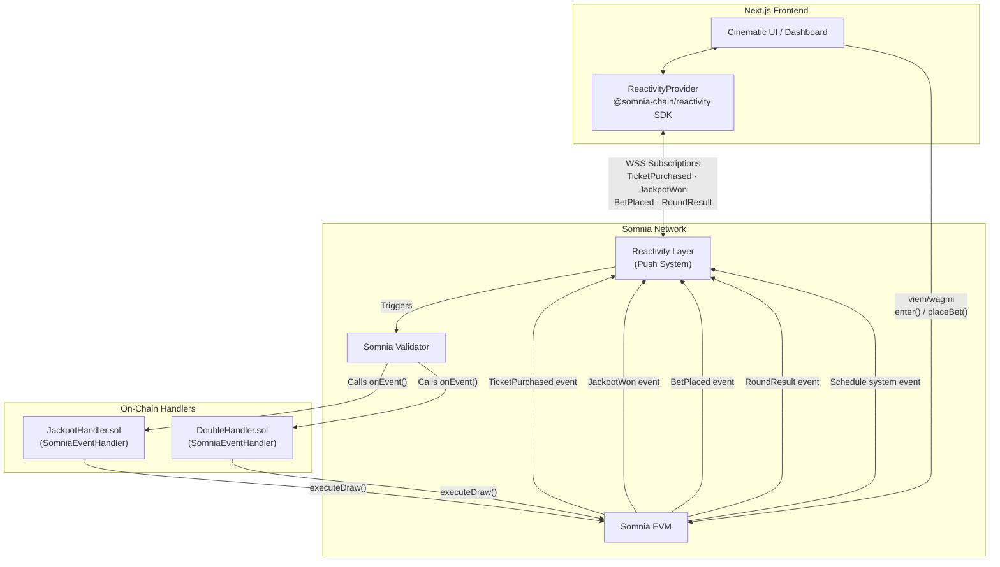

<p align="center">
  
</p>

# BlackTree — Your Onchain iGaming Platform

> The first on-chain jackpot that feels like watching a live event — not refreshing a page.

BlackTree is a real-time, on-chain gaming platform built natively on the **Somnia Network**. It features two games — a **fixed-price Jackpot** and a **color-roulette Double** — both powered by Somnia's native push-reactivity system to deliver a cinematic, zero-latency experience without any centralized polling.

[](https://opensource.org/licenses/MIT)
[](https://somnia.network)
[](https://soliditylang.org)
[](https://nextjs.org)
[](https://nestjs.com)

---

## The Games

### Jackpot

Users buy a fixed-price ticket (e.g., 5 STT) to enter a round. The countdown timer starts once the 2nd participant enters. When time expires, a verifiable on-chain draw selects up to 3 winners from the prize pool:

| Players in round | 1st Place | 2nd Place | 3rd Place | Platform fee |
|---|---|---|---|---|
| 2 players | 75% | 20% | — | 5% |
| 3+ players | 70% | 20% | 5% | 5% |

The winner reveal triggers a cinematic sequence pushed to every connected screen simultaneously.

### Double

Players bet any amount (minimum bet, in multiples) on **RED**, **BLACK**, or **WHITE** before a 60-second round closes. A 15-second locked phase prevents last-second bets. At draw time, a number from 0 to 14 is drawn on-chain:

| Number | Color | Multiplier | Probability |
|---|---|---|---|
| 0 | WHITE | 14x | 1/15 (~6.7%) |
| 1 – 7 | RED | 2x | 7/15 (~46.7%) |
| 8 – 14 | BLACK | 2x | 7/15 (~46.7%) |

Winners receive their bet multiplied by the color's payout factor (minus the 5% platform fee). Both live betting pools and the final result are pushed instantly to all frontends via WebSocket.

---

## Powered by Somnia Reactivity

This is the core architectural contribution of BlackTree. Traditional EVM dApps force developers to "pull" blockchain state through repeated polling: `getLogs` in a loop, `setInterval` for balances, or centralised WebSocket servers run by the dApp team. **Somnia Reactivity eliminates all of that.**

> **Somnia Reactivity** is a pub/sub system baked directly into the blockchain. It pushes
> event notifications — combined with related on-chain state — to subscribers in real-time
> via the network's own validators/nodes. No polling. No centralised WebSocket server.
> No external oracles.
>
> Official Docs: <https://docs.somnia.network/developer/reactivity>

### The Problem BlackTree Solves

| Concern | Traditional EVM dApp | BlackTree with Reactivity |
|---|---|---|
| **Jackpot counter update** | Page reload or polling every N seconds | Pushed instantly when `TicketPurchased` fires |
| **Winner announcement** | User checks result manually | All browsers receive `JackpotWon` push — cinematic sequence triggers |
| **Draw execution** | Centralised keeper bot required | `Schedule` system event triggers `JackpotHandler.onEvent()` on-chain |
| **Bet pool update** | Periodic RPC queries | Pushed instantly when `BetPlaced` fires |
| **Round result** | User refreshes to see outcome | `RoundResult` push triggers spin animation on every connected screen |
| **Infra complexity** | Poll loops, retry logic, RPC costs | One WebSocket subscription per event |

---

### Off-Chain: TypeScript SDK

The Somnia Reactivity TypeScript SDK (`@somnia-chain/reactivity`) is initialized once at application level and shared via React context.

**[`ReactivityProvider.tsx`](frontend/src/components/ReactivityProvider.tsx)**

```tsx
import { SDK } from "@somnia-chain/reactivity";
import { createPublicClient, webSocket } from "viem";

// A viem public client backed by the Somnia WebSocket RPC
const publicClient = createPublicClient({
  chain: somniaTestnetWithWss,        // chain id 50312
  transport: webSocket("wss://dream-rpc.somnia.network/ws"),
});

// The SDK takes ownership of the WebSocket connection
const reactivitySdk = new SDK({ public: publicClient });
```

The `SDK` instance is injected into the React component tree. Every component that needs live updates consumes the `useReactivity()` hook to access it — no prop drilling, no duplicate connections.

---

### Off-Chain: Jackpot Subscriptions

**[`useJackpotReactivity.ts`](frontend/src/hooks/useJackpotReactivity.ts)**

Two subscriptions are registered against the `BlackTree.sol` contract address. Topic filters are computed as `keccak256` of each event's canonical signature — exactly as the Somnia SDK expects.

#### Subscription 1 — `TicketPurchased`

Fires every time a user calls `enter()`. The push payload contains `participant`, `newJackpot`, and `roundId`.

```ts
const TOPIC_TICKET_PURCHASED = keccak256(toBytes("TicketPurchased(address,uint256,uint256)"));

await sdk.subscribe({
  eventContractSources: [JACKPOT_CONTRACT_ADDRESS],
  topicOverrides: [TOPIC_TICKET_PURCHASED],
  onData: (data) => {
    const { participant, newJackpot, roundId } = decodeEventLog({ ... });
    // React state update: live feed gains a new row, jackpot counter animates up
  },
});
```

**Result:** Every connected browser sees the jackpot grow and the new participant appear with zero delay — no page refresh, no polling.

#### Subscription 2 — `JackpotWon`

Fires once per round when the draw executes. The push payload contains all three winner addresses and the total prize.

```ts
const TOPIC_JACKPOT_WON = keccak256(toBytes("JackpotWon(uint256,address,address,address,uint256)"));

await sdk.subscribe({
  eventContractSources: [JACKPOT_CONTRACT_ADDRESS],
  topicOverrides: [TOPIC_JACKPOT_WON],
  onData: (data) => {
    const { roundId, first, second, third, totalPrize } = decodeEventLog({ ... });
    // Cinematic 10-second draw reveal sequence triggers on ALL connected screens simultaneously
  },
});
```

**Result:** The winner reveal is a broadcast event — every spectator sees the same animation at the same instant, driven by the chain itself.

---

### Off-Chain: Double Game Subscriptions

**[`useDoubleReactivity.ts`](frontend/src/hooks/useDoubleReactivity.ts)**

The Double game registers two subscriptions against `BlackTreeDouble.sol`.

#### Subscription 1 — `BetPlaced`

```ts
const TOPIC_BET_PLACED = keccak256(toBytes("BetPlaced(address,uint8,uint256,uint256,uint256)"));

await sdk.subscribe({
  eventContractSources: [DOUBLE_CONTRACT_ADDRESS],
  topicOverrides: [TOPIC_BET_PLACED],
  onData: (data) => {
    const { player, color, amount, newColorTotal, roundId } = decodeEventLog({ ... });
    // RED / BLACK / WHITE pool bars animate in real-time as bets pour in
  },
});
```

#### Subscription 2 — `RoundResult`

```ts
const TOPIC_ROUND_RESULT = keccak256(toBytes("RoundResult(uint256,uint8,uint8,uint256)"));

await sdk.subscribe({
  eventContractSources: [DOUBLE_CONTRACT_ADDRESS],
  topicOverrides: [TOPIC_ROUND_RESULT],
  onData: (data) => {
    const { roundId, number, color, totalPayout } = decodeEventLog({ ... });
    // Spin animation resolves, winners glow, losers fade — on every screen at once
  },
});
```

---

### On-Chain: Solidity Event Handler

Somnia Reactivity also supports **on-chain subscribers**: Solidity contracts that implement `SomniaEventHandler` and are invoked directly by the network's validators when a subscribed event fires. BlackTree uses this for autonomous draw execution.

**[`JackpotHandler.sol`](contracts/contracts/JackpotHandler.sol)**

```solidity
contract JackpotHandler is SomniaEventHandler {
    IBlackTree public blackTree;

    // Invoked by Somnia validator when the `Schedule` system event fires
    function onEvent(bytes calldata /* data */) external override {
        address[] memory participants = blackTree.getParticipants();
        if (participants.length < 2) return; // Rollover: not enough players

        (address first, address second, address third) = _drawWinners(participants);
        blackTree.executeDraw(first, second, third);

        _scheduleNext(); // Re-arms the Schedule subscription for the next round
    }
}
```

**[`DoubleHandler.sol`](contracts/contracts/DoubleHandler.sol)** follows the same pattern, additionally computing the winning number and color multiplier on-chain before calling `executeDraw()`.

The `Schedule` system event (`event Schedule(uint256 indexed timestampMillis)`) is a Somnia Reactivity primitive that lets a contract publish a one-shot future alarm. When the timestamp is reached, the validator calls `onEvent()` on whichever handler has subscribed — **no keeper bot, no external cron job required.**

---

### Architecture Diagram



---

## Project Structure

```
blacktree-jackpot/
├── contracts/          # Hardhat — Solidity smart contracts
│   └── contracts/
│       ├── BlackTree.sol          # Jackpot game logic + events
│       ├── BlackTreeDouble.sol    # Double game logic + events
│       ├── JackpotHandler.sol     # On-chain Reactivity handler (Schedule)
│       └── DoubleHandler.sol      # On-chain Reactivity handler (Schedule)
│
├── frontend/           # Next.js 15 App Router
│   └── src/
│       ├── components/
│       │   └── ReactivityProvider.tsx  # SDK initialization & React context
│       └── hooks/
│           ├── useJackpotReactivity.ts  # TicketPurchased + JackpotWon subscriptions
│           └── useDoubleReactivity.ts   # BetPlaced + RoundResult subscriptions
│
├── backend/            # NestJS — Keeper bot & historical indexer
│   └── src/            #   Closes rounds, executes draws, syncs SQLite via Prisma
│
└── docs/               # Full technical documentation (see below)
```

---

## Getting Started

### Prerequisites

- **Node.js** v18 or higher
- **NPM** or **Yarn**
- A web3 wallet (MetaMask) configured on the **Somnia Testnet** (Chain ID: `50312`)
- Testnet STT tokens — obtain from the [Somnia Faucet](https://somnia.network/faucet)

### 1. Install Dependencies

```bash
# From the repository root
cd contracts && npm install
cd ../backend  && npm install
cd ../frontend && npm install
```

### 2. Configure Environment Variables

Copy `.env.example` from the repo root and fill in your values for each workspace:

**`backend/.env`**

```env
NEXT_PUBLIC_JACKPOT_CONTRACT_ADDRESS=your_jackpot_contract_address
PRIVATE_KEY=your_funded_wallet_private_key
```

**`frontend/.env.local`**

```env
NEXT_PUBLIC_JACKPOT_CONTRACT_ADDRESS=your_jackpot_contract_address
NEXT_PUBLIC_DOUBLE_CONTRACT_ADDRESS=your_double_contract_address
```

### 3. Backend (NestJS + Prisma)

The backend acts as the **Keeper** and **Indexer** — it orchestrates round lifecycle and syncs historical wins to SQLite for the stats dashboard.

```bash
cd backend
npx prisma db push   # Initialize the SQLite database
npm run start:dev    # Start the development server
```

### 4. Frontend (Next.js)

```bash
cd frontend
npm run dev
```

Open <http://localhost:3000>.

---

## Smart Contracts Reference

| Contract | Description |
|---|---|
| `BlackTree.sol` | Jackpot game: `enter()`, blockhash PRNG draw, emits `TicketPurchased` & `JackpotWon` |
| `BlackTreeDouble.sol` | Double game: `placeBet()`, color-roulette draw, emits `BetPlaced` & `RoundResult` |
| `JackpotHandler.sol` | Reactivity on-chain handler: `SomniaEventHandler`, triggered by `Schedule` system event |
| `DoubleHandler.sol` | Reactivity on-chain handler: `SomniaEventHandler`, triggered by `Schedule` system event |

---

## Documentation

Detailed technical documentation lives in the [`/docs`](docs/) directory:

| # | Document |
|---|---|
| 01 | [Overview](docs/01-overview.md) |
| 02 | [Architecture](docs/02-architecture.md) |

---

## License

Distributed under the MIT License. See [`LICENSE`](LICENSE) for more information.
