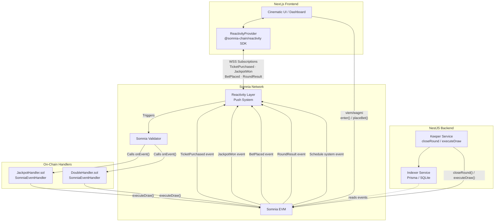

# 04 Architecture: BlackTree — Your Onchain iGaming Platform

## Overview

BlackTree's architecture is composed of four layers:

1. **Smart Contracts** — game logic, prize distribution, and on-chain Reactivity event handlers.
2. **Reactivity Layer** — Somnia's push infrastructure delivering events to off-chain subscribers and triggering on-chain handlers via validators.
3. **Backend** — NestJS keeper that orchestrates round lifecycle and indexes historical data to SQLite.
4. **Frontend** — Next.js application consuming the Somnia Reactivity SDK for zero-polling real-time state.

---

## High-Level Diagram



---

## 1. Smart Contracts Layer (Hardhat + Solidity)

### `BlackTree.sol` — Jackpot

The main user-facing Jackpot contract.

- `enter()`: Accepts STT payment equal to `ticketPrice`, enforces one entry per address per round, appends the address to the participant array, and emits `TicketPurchased(participant, newJackpot, roundId)`. The countdown timer is armed when the 2nd participant enters.
- `closeRound()`: Called when the timer expires. Transitions state to `DRAWING` and commits `drawBlock = block.number + 5` for the blockhash PRNG.
- `executeDraw()`: Reads `blockhash(drawBlock)` to seed the winner selection. Emits `JackpotWon(roundId, first, second, third, totalPrize)`, distributes funds, and resets state for the next round.
- **Randomness:** Commit-reveal on `blockhash`. Safety guard resets `drawBlock` if more than 256 blocks pass (at which point `blockhash` returns 0).

### `BlackTreeDouble.sol` — Double

The color-roulette contract.

- `placeBet(color)`: Accepts any amount that is a multiple of `minBet`, records the bet, and emits `BetPlaced(player, color, amount, newColorTotal, roundId)`. Bets are rejected in the 15-second locked phase before draw time.
- `executeDraw(number, winningColor, multiplier)`: Called by `DoubleHandler`. Pays all winners on the winning color multiplied by `multiplier` (minus 5% fee), emits `RoundResult(roundId, number, color, totalPayout)`, and opens the next round.

### `JackpotHandler.sol` — On-Chain Reactivity Handler

Implements `SomniaEventHandler`. Its `onEvent()` is invoked by the Somnia validator when the `Schedule` system event fires:

```solidity
function onEvent(bytes calldata) external override {
    address[] memory participants = blackTree.getParticipants();
    if (participants.length < 2) return;
    (address first, address second, address third) = _drawWinners(participants);
    blackTree.executeDraw(first, second, third);
    _scheduleNext();
}
```

### `DoubleHandler.sol` — On-Chain Reactivity Handler

Implements `SomniaEventHandler`. Computes the winning number (`seed % 15` using `prevrandao`), maps it to a color and multiplier, and calls `blackTreeDouble.executeDraw()`:

```solidity
// 0 = WHITE (14x) | 1-7 = RED (2x) | 8-14 = BLACK (2x)
uint8 number = uint8(seed % 15);
```

---

## 2. Reactivity Layer (Push Infrastructure)

BlackTree uses the following Somnia Reactivity primitives:

| Primitive | Type | Contract | Purpose |
|---|---|---|---|
| `TicketPurchased` | Off-chain subscription | `BlackTree.sol` | Updates live participant feed and jackpot counter on all frontends |
| `JackpotWon` | Off-chain subscription | `BlackTree.sol` | Triggers the cinematic 10-second draw reveal sequence across all connected browsers |
| `BetPlaced` | Off-chain subscription | `BlackTreeDouble.sol` | Animates RED / BLACK / WHITE pool bars in real-time for all spectators |
| `RoundResult` | Off-chain subscription | `BlackTreeDouble.sol` | Broadcasts spin outcome and winner animations to all connected screens |
| `Schedule` | On-chain system event | `JackpotHandler.sol` / `DoubleHandler.sol` | Arms a future execution timestamp; validator calls `onEvent()` when it fires |

All off-chain subscriptions are managed by the `@somnia-chain/reactivity` TypeScript SDK connected to `wss://dream-rpc.somnia.network/ws`.

---

## 3. Backend Layer (NestJS + Prisma)

The backend is a NestJS application acting as **Keeper** and **Indexer** for the testnet environment, operating in parallel to the on-chain Reactivity handlers.

- **Keeper Service:** Monitors round timers and calls `closeRound()` + `executeDraw()` via a funded wallet when the on-chain handler is not active.
- **Indexer Service:** Listens to on-chain events (`JackpotWon`, `RoundResult`) and persists historical round results to a local SQLite database via Prisma, powering the stats and leaderboard dashboards on the frontend.

---

## 4. Frontend Layer (Next.js App Router)

| Concern | Technology |
|---|---|
| Framework | Next.js 15 App Router |
| Styling | Tailwind CSS |
| Animations | Framer Motion |
| Wallet connection | `wagmi` + `viem` (MetaMask) |
| Reactivity SDK | `@somnia-chain/reactivity` |
| State management | React context + hooks |

**Key hooks:**

- `ReactivityProvider.tsx` — Initializes the SDK once and distributes it via React context.
- `useJackpotReactivity.ts` — Manages `TicketPurchased` and `JackpotWon` subscriptions.
- `useDoubleReactivity.ts` — Manages `BetPlaced` and `RoundResult` subscriptions.

No polling (`setInterval`, `useQuery` on a timer, or `getLogs` loops) is used anywhere in the frontend for live game state. All updates arrive exclusively via WebSocket push.

---

## Data Flow: Ticket Purchase (End-to-End)

```
User clicks "Enter"
  → wagmi sends enter() tx to Somnia EVM
  → EVM executes: participant added, currentJackpot updated
  → EVM emits TicketPurchased event
  → Somnia Reactivity pushes event via WSS to all subscribers
  → useJackpotReactivity.onData() fires in every open browser
  → React state updates: live feed row added, jackpot counter animates
  ← User sees the update in < 1 block time (~100ms)
```

## Data Flow: Draw Execution (End-to-End)

```
Round timer expires
  → JackpotHandler.onEvent() called by Somnia validator (Schedule event)
  → _drawWinners() selects 3 addresses
  → blackTree.executeDraw() called: funds distributed, JackpotWon emitted
  → Somnia Reactivity pushes JackpotWon to all WSS subscribers
  → useJackpotReactivity.onData() fires in every open browser
  → Cinematic 10-second draw reveal sequence begins simultaneously on all screens
```
