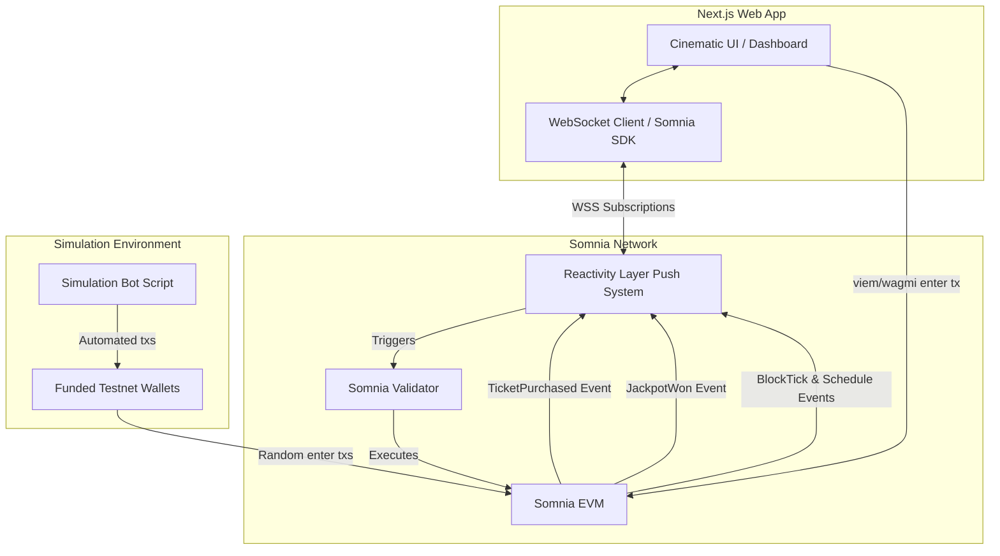

# 04 Architecture: BlackTree Jackpot

## Overview
The architecture of BlackTree relies entirely on the **Somnia Reactivity** framework to enable real-time, push-based updates without any traditional web2 backend infrastructure (e.g., Node.js servers handling WebSockets). 

## High-Level Diagram

## 1. Smart Contracts Layer (Foundry)
- **`BlackTree.sol`**: The main user-facing contract. It receives STT payments (`enter()`), stores the participant array, and emits events (`TicketPurchased`, `JackpotWon`). It holds the prize pool balance.
- **`JackpotHandler.sol`**: A secondary contract implementing `SomniaEventHandler`. It is authorized to trigger the winner selection inside `BlackTree.sol`. When the `Schedule` event fires, the Somnia validator executes `_onEvent()` in this handler, distributing funds and resetting the round.

## 2. Reactivity Layer (Push Infrastructure)
BlackTree utilizes multiple Reactivity primitives:
- **`TicketPurchased` Subscription:** Off-chain WebSocket subscription to push new participant addresses and jackpot size directly to the Next.js frontend to update the live feed.
- **`Schedule` System Event:** On-chain subscription created by `JackpotHandler.sol` to automatically schedule the next draw timestamp.
- **`BlockTick` System Event:** Off-chain WebSocket subscription to power the hyper-accurate, sub-second countdown timer on the frontend.
- **`JackpotWon` Subscription:** Off-chain WebSocket subscription telling the frontend to initiate the cinematic 10-second draw reveal sequence.

## 3. Frontend Layer (Next.js App Router)
- **Framework:** Next.js with React Server Components (where applicable) and Client Components for interactivity.
- **Styling:** Tailwind CSS + Framer Motion for high-framerate, cinematic dark-mode visual effects (glowing text, flickering addresses, sliding lists).
- **Web3 Integration:** `wagmi` and `viem` for connecting wallets (MetaMask) and submitting the `enter()` transaction.
- **No Polling:** `useQuery` or `setInterval` will NOT be used for game state. All state updates arrive via pushed WebSocket events.

## 4. Simulation Bot 
A standalone Node.js script designed strictly for the Hackathon/Testnet environment.
- **Mechanism:** Initializes an array of private keys with test STT. Loops indefinitely, picking a random wallet to buy a ticket at random intervals (e.g., every 5-20 seconds).
- **Purpose:** Keeps the dashboard mathematically alive, providing a continuous stream of `TicketPurchased` WSS events to the frontend so the judges can observe the dynamic UI without manually entering transactions from 30+ wallets.
